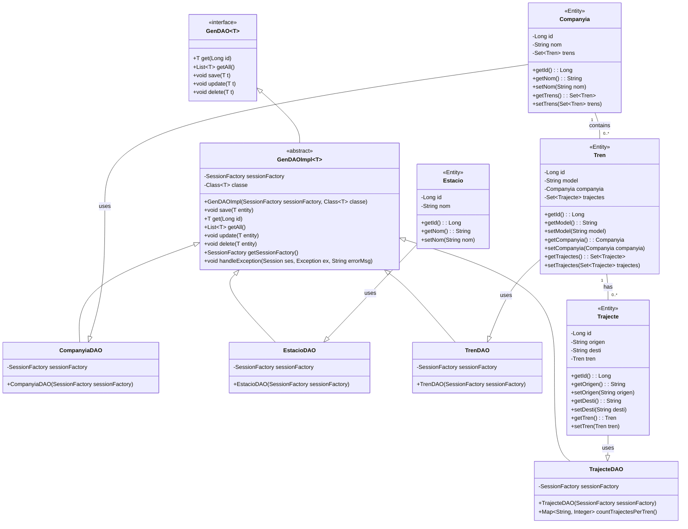

# TENFE

1. De quina lògica d’aplicació s’encarrega el Patró DAO?

    **DAO (Data Acces Object)** s'encarrega de separa la lògica d'acces a les dades
    de la resta de la lògica. S'encapsul·len les operacions relacionades amb l'acces a les
    dades en classes específiques.

2. Per què considereu què és útil el patró DAO i en què us ha servit?

    - Individualització de responsabilitats
    - Reutilització de codi
    - Adaptabilitat: Si es canvia el sistema de persistir, només s'hauria de canviar els DAO

    M'ha servit per centralitzar la lògica d'acces a un sol lloc i reduïr la complexitat del Main.

3. Heu hagut de fer cap ajust al vostre codi d’aplicació (Main, Controladors, Vistes, altres classes que no siguin DAO, etc.) ? Si és així, detalleu de forma breu quins canvis heu fet i per què?

    Doncs he hagut de canviar com s'utilitzaven els metodes dels DAO, 
    a demés d'implementar la gestió d'exepcions per als nous metodes del DAO.

4. D’igual forma que s’ha fet a l’enunciat, completeu el diagrama de classes de l’activitat A01 de la UF2 incorporant les interfícies, la classe abstracta i els DAOs. Per acoblar això, cal que relacioneu cada classe del model amb el seu DAO (sols aquelles classes que heu treballat a l’A03, no totes!!! ):

5. Valoreu el paper que hi juga la classe abstracta. És en tots els casos necessària? En el cas de l’activitat A02 de la UF2, on vau emprar JDBC, penseu que seria d’utilitat?

    La classe abstracta (GenDAOImpl<T>) centralitza la lògica comuna 
    dels DAOs, com ara operacions CRUD genèriques, evitant repeticions 
    i assegurant consistència. Tot i això, no és estrictament 
    necessària en tots els casos; si els DAOs tenen requeriments molt 
    específics o poc compartits, pot no ser útil.

    En l'activitat A02 amb JDBC, una classe abstracta hauria estat 
    útil per encapsular la gestió de connexions, sentències SQL i 
    excepcions, reduint duplicacions i millorant la mantenibilitat. 
    Tanmateix, no era imprescindible si les operacions eren simples i 
    poc reutilitzades.